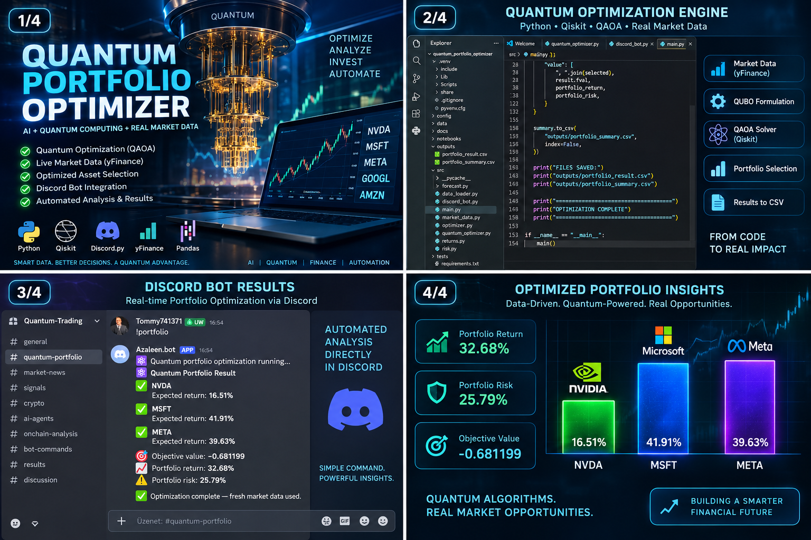

# Quantum Portfolio Optimizer with QAOA & Discord

Hybrid quantum-classical portfolio optimization project built with Python, Qiskit and QAOA, using real financial market data and Discord integration.

The system combines quantitative finance, portfolio optimization and quantum computing in a practical workflow designed to analyze assets, model portfolio risk and search for optimized portfolio allocations.

## Project Overview

Traditional portfolio optimization becomes computationally difficult as the number of assets and constraints increases.

This project explores a hybrid quantum-classical approach where classical financial analysis is combined with the Quantum Approximate Optimization Algorithm (QAOA).

Real market data is processed in Python, transformed into an optimization problem and evaluated using Qiskit-based quantum optimization techniques.

## Core Workflow

1. Market Data Collection
   - Real financial market data
   - Historical asset prices
   - Expected returns
   - Volatility
   - Correlation and covariance analysis

2. Classical Portfolio Analysis
   - Expected portfolio return
   - Portfolio risk
   - Covariance matrix
   - Asset selection
   - Risk-return evaluation

3. Quantum Optimization
   - Qiskit
   - QAOA
   - Binary portfolio selection
   - QUBO optimization model
   - Quantum circuit execution
   - Hybrid quantum-classical optimization

4. Portfolio Decision Engine
   - Compares candidate portfolios
   - Evaluates expected return and risk
   - Identifies optimized asset combinations
   - Produces structured portfolio results

5. Discord Integration
   - Automated Python bot
   - Portfolio analysis commands
   - Optimization results
   - Market information
   - Structured alerts and output

## Technology Stack

- Python
- Qiskit
- QAOA
- Quantum Optimization
- NumPy
- Pandas
- yfinance
- Financial Market Data
- Portfolio Theory
- Discord Bot
- APIs

## Optimization Model

The portfolio optimization problem can be represented as a binary optimization problem.

Each asset is represented by a binary variable:

xᵢ ∈ {0,1}

where:

- 1 = asset selected
- 0 = asset not selected

The objective balances expected return against portfolio risk.

A simplified formulation is:

Minimize:

Risk − λ × Expected Return

where λ controls the trade-off between risk and return.

The optimization problem can then be transformed into a QUBO representation suitable for QAOA.

## Hybrid Quantum-Classical Architecture

The project follows a hybrid workflow:

Market Data
↓
Python Data Processing
↓
Return & Risk Calculation
↓
Covariance Matrix
↓
Portfolio Optimization Model
↓
QUBO Formulation
↓
QAOA / Qiskit
↓
Optimized Portfolio
↓
Discord Output

Classical computing handles market data processing and financial calculations, while the quantum optimization layer explores candidate portfolio configurations.

## Project Visual

## Project Goal

The goal of this project is to explore how quantum optimization algorithms can be integrated with real financial market data and classical portfolio analytics.

The project focuses on practical hybrid quantum-classical workflows rather than purely theoretical quantum computing.

Long-term development areas include:

- Larger asset universes
- Advanced portfolio constraints
- Dynamic risk models
- Real-time market data
- Quantum hardware execution
- Benchmarking QAOA against classical optimization
- AI-assisted portfolio analysis
- Automated Discord reporting

## Status

Active development and research project.

The current implementation focuses on building and testing the hybrid architecture, portfolio optimization workflow and QAOA-based optimization approach.
